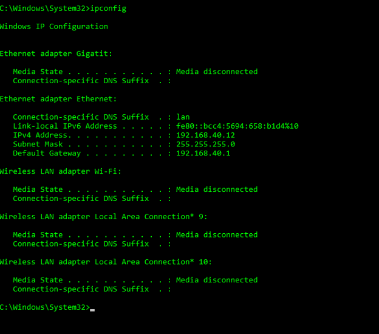
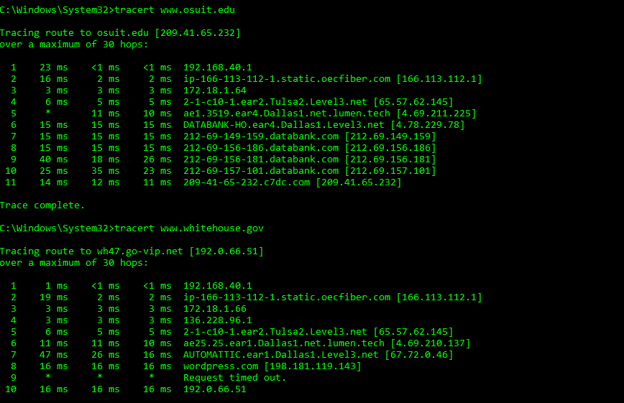
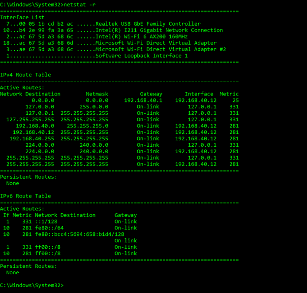

# Windows Security Tools Lab

**Platform:** Windows 11

**Technology:** Windows Command Prompt

**Focus:** Network Diagnostics & Security Fundamentals

---

# Overview

This project demonstrates the use of several Windows networking and security tools commonly used by system administrators and cybersecurity professionals. These exercises focus on network troubleshooting, connectivity testing, route analysis, and viewing system network information through the Windows Command Prompt.

---

# Technologies Used

- Windows Command Prompt
- Windows 11
- TCP/IP
- ICMP
- Network Diagnostics

---

# Skills Demonstrated

- Network troubleshooting
- Connectivity testing
- TCP/IP fundamentals
- Route analysis
- Network statistics
- Routing table analysis
- Command-line administration

---

# Project Walkthrough

## Step 1 - View Network Configuration

Used the **ipconfig** command to display the local network configuration, including IP address, subnet mask, and default gateway.

  

---

## Step 2 - Test Network Connectivity

Used the **ping** command to verify communication with another host and measure network response times.

  

---

## Step 3 - Trace the Network Path

Used **tracert** to display each network hop between the local computer and the destination host.

  

---

## Step 4 - View Active Network Connections

Used **netstat** to display active TCP connections and listening ports.

  

---

## Step 5 - View Ethernet Statistics

Used **netstat -e** to display Ethernet statistics, including transmitted and received bytes and packets.

  

---

## Step 6 - View the Routing Table

Used **netstat -r** to display the system routing table and active network routes.

  

---

# Project Outcome

This project strengthened my understanding of Windows networking tools used to diagnose connectivity issues, analyze network traffic, verify routing information, and troubleshoot communication problems. These command-line utilities are commonly used in IT support, systems administration, and cybersecurity environments.

---

# Real-World Uses

The tools demonstrated in this project are commonly used to:

- Verify network connectivity
- Diagnose communication issues
- View active network connections
- Analyze routing information
- Troubleshoot TCP/IP problems
- Validate network configurations
- Support Windows system administration

---

# Conclusion

Completing this lab provided practical experience using Windows networking tools to troubleshoot systems and analyze network activity. These foundational skills are applicable to help desk, systems administration, and cybersecurity roles where command-line diagnostics are frequently used.
