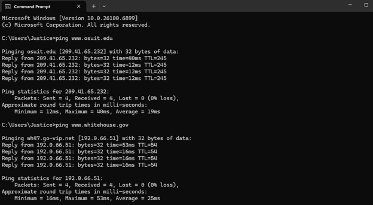
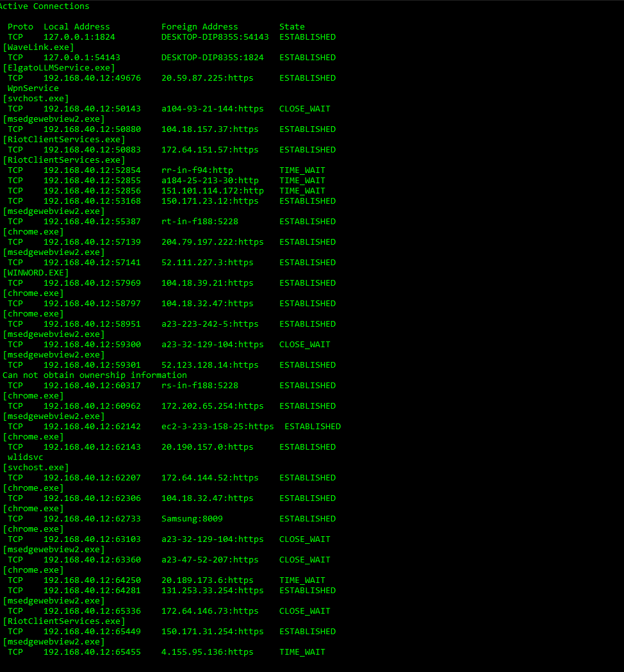
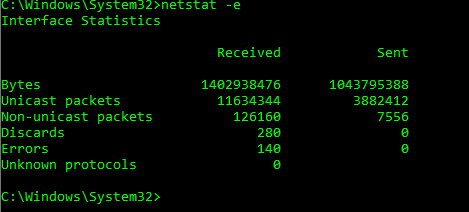

# Windows Security Tools Lab

## Overview

This repository demonstrates several commonly used Windows networking and cybersecurity tools. These exercises were completed as part of my cybersecurity coursework and helped build foundational knowledge in network troubleshooting, system administration, and security analysis.

---

## Platform

**Windows 11**

---

## Technologies Used

- Windows Command Prompt
- Windows PowerShell
- TCP/IP Networking
- Network Diagnostics

---

# Security Tools Covered

## Ping

Tests connectivity between systems and measures response time.

### Skills Demonstrated

- Connectivity testing
- Packet loss analysis
- Latency verification

---

## Netstat

Displays active network connections and listening ports.

### Skills Demonstrated

- Active connection analysis
- Listening ports
- Connection states
- Network troubleshooting

---

## Tracert

Displays the route packets travel to reach a destination.

### Skills Demonstrated

- Route tracing
- Hop analysis
- Network path troubleshooting

---

## Nmap (Concepts)

Studied how Nmap is used for host discovery and port scanning.

### Skills Demonstrated

- Network enumeration
- Port discovery
- Host identification

---

## Wireshark (Concepts)

Studied packet analysis techniques used for troubleshooting and security investigations.

### Skills Demonstrated

- Packet inspection
- Traffic analysis
- Protocol identification

---

## SNORT (Concepts)

Studied intrusion detection and alert monitoring.

### Skills Demonstrated

- Intrusion Detection Systems (IDS)
- Threat monitoring
- Signature detection

---

## Honeybot (Concepts)

Studied honeypot technology used to detect and analyze attacker behavior.

### Skills Demonstrated

- Honeypots
- Threat intelligence
- Attack observation

---

# Screenshots

## Ping Testing

Description of network connectivity tests.

---

## Netstat Connections

Viewing active network connections.

---

## Netstat Help

Viewing available Netstat options.

---

## Netstat -b

Displaying executable files associated with active connections.

---

## Netstat -e

Viewing Ethernet statistics.

---

## Netstat -r

Viewing the routing table.

---

## Tracert

Tracing packet routes across the internet.

---

# Skills Demonstrated

- Windows Administration
- Network Troubleshooting
- TCP/IP
- Security Fundamentals
- Network Diagnostics
- Command Line
- Cybersecurity Concepts
- PowerShell
- Command Prompt

---
